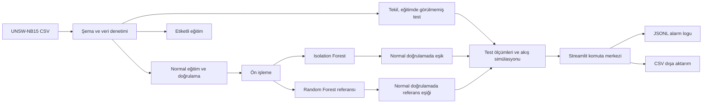

# SENTINEL 26 — Siber Güvenlik için Yapay Zekâ ile Anomali Tespiti ve Tehdit Analizi

## 1. Konu, amaç ve sınır

SAYZEK 2025–2026 konu listesindeki **26. proje**, olası siber saldırıları yapay zekâ ile önceden fark etmeyi, kullanıcıya anlık bildirim vermeyi ve anomalileri log dosyasına kaydetmeyi ister. SENTINEL 26, bu fikrin ölçülebilir bir bitirme projesi prototipidir. Tek geliştiricinin sürdürebileceği yerel bir uygulamada ağ akışı kayıtları puanlanır, alarm eşiği değiştirilebilir, alarmlar açıklayıcı ipuçlarıyla gösterilir ve JSONL biçiminde saklanır.

**Şu anki ürün sınırı:** Gerçek ağı veya paketleri dinlemiyoruz. UNSW-NB15 test kayıtları, uygulamada saniyelik partiler hâlinde tekrar oynatılıyor. Böylece model çıkarımı, alarm ve kayıt döngüsü çalışır; ancak canlı ağ tespiti iddiası kurulmaz.

**Önerilen tez sorusu:** Eğitimde saldırı etiketlerine ihtiyaç duymayan bir ağ anomalisi modeli, makul bir yanlış alarm bütçesi altında hangi saldırı türlerini yakalayabilir; etiketli bir referans modelle aradaki fark nedir?

## 2. Kimin hangi sorununu çözüyor?

Bir güvenlik analisti, binlerce ağ akışı içinden elle incelemeye değer olanları seçmek ister. Her akış için karar skoru, eşik, zaman, alarm seviyesi ve sıra dışı alanların kısa ipuçlarını tek ekranda görür. Eğitmen/jüri, sistemin nasıl ölçüldüğünü ve yanlış alarmların maliyetini aynı uygulamada inceleyebilir. Proje, analiste son karar yetkisi bırakır; otomatik engelleme veya saldırı türünü kesin teşhis etme iddiası taşımaz.

## 3. Ölçülebilir hedefler ve kabul ölçütleri

| Hedef | Kabul ölçütü | Mevcut durum |
| --- | --- | --- |
| Tekrarlanabilir veri hattı | Kaynak, satır sayısı ve SHA-256 belgeli; sabit rastgele tohum | Tamamlandı |
| Etiketsiz anomali modeli | Yalnızca normal eğitim kayıtları ile eğitilir | Tamamlandı |
| Adil değerlendirme | Eşik normal doğrulama kayıtlarıyla seçilir; test etiketleri eşik için kullanılmaz | Tamamlandı |
| Veri sızıntısı kontrolü | `id`, `label`, `attack_cat` özellik değildir; testin eğitimle çakışan/tekrarlı satırları ana ölçümden çıkarılır | Tamamlandı |
| Anlık demo | Test akışları kademeli puanlanır, karar ve gecikme ekranda görünür | Tamamlandı; simülasyon |
| Kalıcı alarm | Alarm, zaman damgası ve ipuçları JSONL dosyasına eklenir | Tamamlandı |
| Karşılaştırma | Etiketli referans model ve precision, recall, F1, PR-AUC, FPR karşılaştırılır | Tamamlandı |
| Gerçek ağ verisi | Ağdan akış çıkarma, şema eşleştirme ve sahada doğrulama | Sonraki faz |

## 4. Mimari

Katmanlar:

- **Veri:** Yayımlanmış eğitim/test CSV dosyaları. `download_data.py` bilinen hash ve satır sayısını doğrular.
- **Model:** `engine.py` içinde sayısal alanlara eksik değer doldurma, `log1p`, RobustScaler; kategorik alanlara eksik değer doldurma ve OneHotEncoder uygulanır. İşlemler yalnızca eğitim verisiyle öğrenilir.
- **Karar:** Isolation Forest anomali skoru üretir. Hedef yanlış alarm oranı, normal doğrulama skorlarının yüzdeliğinden eşik üretir. Etiketli Random Forest aynı ekranda ayrı bir referanstır.
- **Sunum:** `app.py` Streamlit ekranı, parti hâlinde tekrar oynatma, model laboratuvarı, veri/log sayfası ve CSV puanlaması.
- **Kayıt:** `alert_log.py` yerel JSONL alarm günlüğü. Her satır bağımsız JSON olayıdır; `run_id` ile oturum ayrılır.

## 5. Veri ve deney protokolü

UNSW-NB15'in yayımlanmış ayrımı 175.341 eğitim ve 82.332 test satırıdır. Her satırda 45 sütun vardır; üçü (`id`, `label`, `attack_cat`) modele verilmez. 42 akış özelliği kullanılır. `attack_cat` sadece sonradan saldırı türü bazında değerlendirmeye yarar. Veri akademik kullanıma açık olarak tanımlanır; kaynak ve atıf `data/README.md` içinde yer alır.

Bu kopyada özellik sütunlarının karmasıyla yapılan denetim, eğitimde **74.301 tekrarlı satır**, testte **28.386 tekrarlı satır**, eğitimde de görülen **8.541 test satırı** ve aynı özellikleri taşıyıp farklı etiketlenmiş **229 eğitim özellik grubu** buldu. Eğitimde çelişkili özellik grupları çıkarıldı; kalan eğitim satırları tekilleştirildi. Testte hem eğitimde görülmemiş hem test içinde ilk kez görülen **52.644 satır** ana değerlendirmeyi oluşturur. Yayımlanmış tam test ayrımının sonuçları da karşılaştırma için saklanır. Bu denetim yapılmadan verilen skorlar veri tekrarları nedeniyle yanıltıcı olabilir.

Akış:

1. Yayımlanmış eğitim/test ayrımını koru.
2. Özellikleri seç; etiket ve kimlik alanlarını çıkar.
3. Eğitim verisinde çelişkili özellik gruplarını ve tam özellik tekrarlarını çıkar.
4. Temiz normal eğitim satırlarını `%80 eğitim / %20 normal doğrulama` olarak ayır.
5. Ön işlemeyi yalnızca normal eğitim parçasında öğren, Isolation Forest'ı bu parçayla eğit.
6. Etiketli referansı, normal doğrulama satırları hariç temiz eğitim verisinde eğit.
7. Her iki modelin eşiğini yalnızca normal doğrulama skorlarıyla, aynı hedef yanlış alarm oranında belirle.
8. Precision, recall, F1, PR-AUC, ROC-AUC ve gerçek test FPR'yi tekil/görülmemiş testte ölç. Tür bazlı recall ve 1000 normal akış başına alarmı ayrıca raporla.

Buradaki **hedef FPR**, doğrulama kümesindeki normal kayıtlar için eşiği belirler. Test FPR'nin aynı çıkması beklenmez; veri dağılımı farklıdır.

## 6. İlk gerçek ölçümler

Varsayılan eşik, normal doğrulamada `%2` hedef yanlış alarm ile seçildi. Aşağıdaki metrikler 52.644 tekil/görülmemiş test akışına aittir:

| Model | Precision | Recall | F1 | PR-AUC | Test FPR | 1000 normalde yanlış alarm |
| --- | ---: | ---: | ---: | ---: | ---: | ---: |
| Etiketsiz Isolation Forest | 0,676 | 0,074 | 0,134 | 0,532 | 0,020 | 20,1 |
| Etiketli Random Forest referansı | 0,864 | 0,829 | 0,846 | 0,948 | 0,073 | 73,4 |

Isolation Forest bu sıkı eşikte saldırıların yalnızca yaklaşık `%7,4`'ünü yakalıyor. Bu, projenin açık araştırma sonucudur; sistemin etkisini olduğundan iyi göstermiyoruz. Hedef FPR `%5` seçilince etiketsiz recall yaklaşık `%20,5`, test FPR yaklaşık `%7,6`; hedef `%10` seçilince recall yaklaşık `%35,1`, test FPR yaklaşık `%15,5` olur. Referans model etiketli saldırıları eğitimde gördüğü için üstünlüğü beklenir; iki yaklaşım aynı öğrenme koşullarına sahip değildir.

Saldırı türleri arasında ciddi fark vardır: örneğin varsayılan eşikte `Generic` recall `%38,0`, `Exploits` `%0,4`, `Reconnaissance` `%0,04` düzeyindedir. Tek bir toplam skorla başarı iddia etmek yanıltıcı olur. Ayrıca testte saldırı oranı yüksektir; gerçek ağda saldırı prevalansı farklı olduğunda precision değişir.

## 7. Tez için deney matrisi

| Deney | Değişken | Çıktı | Sorusu |
| --- | --- | --- | --- |
| Eşik eğrisi | Hedef FPR `%1, %2, %5, %10, %15, %20` | Recall, precision, gerçek FPR, alarm hacmi | Kaç yanlış alarma karşı kaç saldırı yakalanıyor? |
| Model kıyası | Isolation Forest / etiketli Random Forest | PR-AUC, F1, tür bazlı recall | Etiketlerin kazancı nedir? |
| Temizleme etkisi | Tam test / tekil-görülmemiş test | Tüm metrikler | Veri tekrarları sonucu ne kadar değiştiriyor? |
| Saldırı türleri | Dokuz saldırı kategorisi | Kategori recall ve örnek sayısı | Hangi saldırılar anomali gibi görünmüyor? |
| Prevalans duyarlılığı | Sabit TPR/FPR ile varsayımsal saldırı oranları | Beklenen precision | Gerçek kurum ağına aktarımda alarm isabeti nasıl değişir? |
| Çıkarım yükü | 1/5/10/20/50 kayıt/sn demo partileri | Parti gecikmesi, bellek | Yerel makine demo için yeterli mi? |

İlk beş deneyin verileri/arayüzleri mevcut. Prevalans duyarlılığı, testte ölçülen recall ve FPR sabit kalır varsayımıyla hesaplanan bir senaryodur; saha ölçümü değildir. Tekrarlı performans ölçümü tez aşamasında tablo/grafik olarak eklenmeli. Önceden tanımlanmış metrikler ve sabit ayrım, sonradan iyi görünen eşik seçme riskini azaltır.

## 8. Geliştirme aşamaları

### Aşama A — Çalışan prototip (tamamlandı)

Veriyi doğrula; ayrı model ve test değerlendirmesi kur; tekrar sızıntısını ölç; dört sekmeli arayüz yap; alarm akışını JSONL'e yaz; tek komutla başlat. **Çıktı:** Jüriye gösterilebilir yerel demo.

### Aşama B — Akademik güçlendirme (yaklaşık 1–2 hafta)

Eşik ve prevalans deneylerinin grafiklerini rapora çıkar; saldırı türleri için örnek sayısı ve güven aralığı ekle; en çok/az yakalanan türlerden kısa vaka analizi yaz; iki ek etiketsiz algoritmayı aynı temiz ayrım ve eşik protokolüyle karşılaştır. Karşılaştırılacak seçenekler: Local Outlier Factor (yenilik modu) ve HistGradientBoosting veya Autoencoder; ikinci seçenek etiketli/etiketsiz rolüne göre açık tanımlanmalı. **Çıktı:** Savunulabilir araştırma bölümü.

### Aşama C — Canlı ağa yaklaşma (zaman kalırsa)

Zeek/benzeri araçla ağ akışı çıkar, veri sözlüğü ve dönüştürücü kur, yerel laboratuvar ağında izole test yap. UNSW-NB15'teki 42 alanın tamamı ham paketlerden doğrudan çıkmaz. Bu yüzden canlı akış için ayrı ortak özellik kümesi seçme ve yeniden eğitim gerekir. Sonrasında gecikme, kayıp akış, dağılım kayması ve yanlış alarm yükü yeniden ölçülür. **Çıktı:** Gerçek ağ izleme prototipi. Bu aşama bitirme için zorunlu değildir.

### Aşama D — Son teslim

Yöntem ve etik sınırlar, veri kaynağı, deney tabloları, ekran görüntüleri, kurulum ve yeniden üretme adımları, sınırlılıklar ve gelecek çalışma bölümü. **Çıktı:** Tez + sunum + çalışan yerel demo.

### İlk hafta için gerçekçi çalışma sırası

| Gün | Tek kişinin işi | Gün sonunda görülebilir çıktı |
| --- | --- | --- |
| 1 | Mevcut prototipi çalıştır, dört sekmeyi ve `verify.py` kontrolünü dene | Çalışan demo ve doğrulama çıktısı |
| 2 | 42 akış alanından temel olanları, etiket ayrımını ve tekrar denetimini öğren | Bir sayfalık veri sözlüğü ve veri akış şeması |
| 3 | Precision, recall, FPR ve PR-AUC hesabını küçük örneklerle açıkla | Tez yöntem bölümünün ilk taslağı |
| 4 | `%1–%20` eşik deneyini ve saldırı türü tablosunu kaydet; örnek sayılarıyla yorumla | Ölçüm tablosu ve iki grafik |
| 5 | Tam test ile temiz test farkını ve prevalans senaryosunu yaz | Bulguların dürüst değerlendirmesi |
| 6 | Jüri demosunu 6–8 dakikada prova et; ekran görüntüsü ve kurulum adımlarını kontrol et | Sunum akışı ve kurulum kanıtı |
| 7 | Tez giriş/yöntem/bulgular iskeletini bitir, sonraki model deneyini seç | Genişletilebilir tez taslağı |

İlk günün teknik kurulum ve temel demo işleri bu klasörde hazırlanmış durumda. Zaman kısıtlıysa canlı ağ entegrasyonu yerine ölçüm ve anlatım kalitesine odaklanmak daha gerçekçidir.

## 9. Tek kişi için öğrenme sırası

1. **Ağ temeli (yarım gün):** akış, protokol, servis, port, süre, byte ve paket sayıları; IDS ve yanlış alarm kavramları.
2. **Python/veri (yarım gün):** pandas DataFrame, filtreleme, CSV, tekrarlı satır, eğitim/test ayrımı.
3. **Makine öğrenmesi (1 gün):** özellik ve etiket, veri sızıntısı, normalizasyon, OneHotEncoder, Isolation Forest ve Random Forest farkı.
4. **Değerlendirme (yarım gün):** confusion matrix, precision/recall, FPR, PR-AUC, eşik ve veri prevalansı.
5. **Uygulama (yarım gün):** Streamlit durum yönetimi, fragment, JSONL, CSV yükleme/indirme.
6. **Sunum (yarım gün):** negatif sonucu dürüst anlatma, yöntem sınırlarını ve sonraki deneyi gerekçelendirme.

RTX 4060 bu sürüm için gerekli değildir; scikit-learn modelleri CPU'da çalışır. GPU ancak ileride derin öğrenme modeline geçilirse değerlendirilebilir.

## 10. Jüri demosu (6–8 dakika)

1. **30 sn:** Problem: çok sayıda akış içinde incelemeye değer olanları seçme.
2. **60 sn:** Veri/etiket sızıntısı denetimi; tam test ile tekil/görülmemiş test farkını göster.
3. **90 sn:** Komuta merkezinde varsayılan `%2` hedef eşiği ve gerçek test FPR'yi açıkla.
4. **90 sn:** Akış simülasyonunu başlat; yeni alarm, skor, zaman ve logu göster; bunun test tekrarı olduğunu belirt.
5. **90 sn:** Model laboratuvarında eşik değiştir, recall/yanlış alarm dengesini ve referans model farkını göster.
6. **60 sn:** CSV puanlama ve dışa aktarma; gerçek ağ için neden yeniden özellik çıkarımı gerektiğini söyle.
7. **30 sn:** Araştırma sorusu, mevcut zayıf noktalar ve sonraki deneyler.

## 11. Riskler ve doğru iddia sınırı

- **Düşük etiketsiz yakalama:** Varsayılan sıkı eşikte recall `%7,4`; mevcut model bir kurumsal savunma ürünü sayılmaz. Tezde negatif bulgu ve iyileştirme sorusu olarak ele alınır.
- **Veri yaşı ve dağılımı:** UNSW-NB15 güncel kurum trafiğinin yerine geçmez. Gerçek ağda yeniden test gerekir.
- **Yüksek saldırı prevalansı:** Test precision değeri operasyonel precision olarak sunulamaz. Varsayımsal prevalans analizi eklenir.
- **Açıklama sınırı:** Aykırılık ipuçları normal yüzdelikleriyle üretilir; modelin kararına nedensel açıklama değildir.
- **Canlılık sınırı:** Demo test kayıtlarını tekrar oynatır; ağ dinleyicisi yoktur.
- **Model artefaktı:** `joblib` yalnızca bu projenin yerelde ürettiği güvenilir model dosyasından yüklenmelidir.
- **Etik kullanım:** Yalnızca sahip olunan/izinli ağ verisi kullanılmalı; örnek veri dışındaki gerçek loglarda kişisel veya hassas alanlar ayrıca korunmalıdır.

## 12. Kaynaklar

- SAYZEK, *2025–2026 Yapay Zekâ Temalı Bitirme Projeleri* konu listesi, proje 26, s. 2: `C:/Users/rog/Downloads/sayzek-atp_2025-2026_konular-1759731135-42sejH.pdf`.
- [UNSW-NB15 resmi veri sayfası](https://research.unsw.edu.au/projects/unsw-nb15-dataset); Moustafa ve Slay, *UNSW-NB15: a comprehensive data set for network intrusion detection systems*, MilCIS 2015.
- [Kullanılan CSV kopyasının bulunduğu depo](https://github.com/Nir-J/ML-Projects/tree/master/UNSW-Network_Packet_Classification). Dosya bütünlüğü `data/README.md` içindeki SHA-256 ile doğrulanır.
- [scikit-learn precision–recall değerlendirme örneği](https://scikit-learn.org/stable/auto_examples/model_selection/plot_precision_recall.html).
- [scikit-learn aykırılık tespiti kıyas örneği](https://scikit-learn.org/stable/auto_examples/miscellaneous/plot_outlier_detection_bench.html).
